# TODO

Szerver oldal elkészítése Node.js és Adonis.js segítségével. Nem kell a 2. beadandóban teszt, se a herokura nem kell feltölteni. Ettől függetlenül szeretném azt, hogy publikusan is elérhető legyen az alkalmazás.

Implementálás:
- Admin módban a user listázó és törlő funkciók elkészítése
- ...

# Technical reference

- http://webprogramozas.inf.elte.hu/alkfejl.php
- http://www.adonisjs.com/docs/3.1
- http://knexjs.org/
- http://chancejs.com/

# Open Data Hub

Az *Open Data Hub* egy webes alkalmazás, melyen gyűjteni és rendszerezni tudjuk a nyílt adathalmazokat.

##  Követelményanalízis

### Funkcionális követelmények

- Böngészés és keresés az adathalmazok közt.
- Regisztráció felhasználónév, jelszó és email cím megadásával.
- Bejelentkezés felhasználónév és jelszó megadásával.
- Bejelentkezett felhasználóként:
	- saját jelszó és email cím megtekintése és megváltoztatása,
	- bármely adathalmaz értékelése,
	- sajátok hozzáadása, szerkesztése és törlése.
- Adminisztrátorként:
	- felhasználók kitiltása,
	- adathalamazok és értékelések szerkesztése, törlése.

### Nem funkcionális követelmények

- Kinézete modern, az aktuális trendeknek megfelelő.
- Könnyen átlátható és kezelhető felület.
- Gyorsnak ható működés.
- A felhasználók adatainak biztonságos tárolása.
- Könnyű konfigurálhatóság és bővíthetőség.

### Fogalomjegyzék

- **Nyílt adathalmaz**: Olyan adatok összessége, melyek szabadon elérhetőek az interneten.

### Szerepkörök

- **Vendég**: Csak böngészni és keresni tud az adathalmazok közt. Van lehetősége regisztrálni és bejelentkezni.
- **Felhasználó**: Bejelentkezés után a vendég funkcióit továbbra is eléri, ezen felül meg tudja változtatni a saját jelszavát és email címét, tudja bármelyik adathalmazt értékelni és sajátokat hozzáadni, szerkeszteni és törölni.
- **Adminisztrátor**: Bejelentkezés után a vendég és a felhasználó funkcióit is eléri, ezen felül bármely felhasználót ki tud tiltani és bármely adathalmazt és értékelést tud szerkeszteni és törölni.

#### Szerepkörök szerinti használati esetek

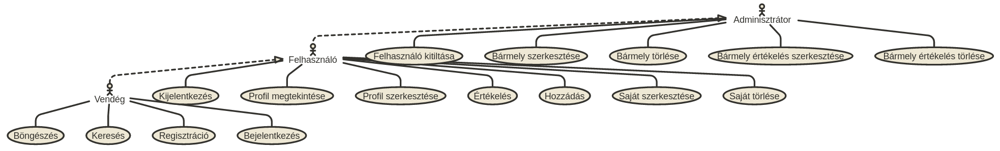

##### Példa egy használati eset folyamatára

Felhasználóként egy adathalmaz bejegyzés módosítása:

1. Bejelentkezik, ha ezt még nem tette meg.
2. Megkeresi azt a saját bejegyzését, amit szerkeszteni szeretne.
3. Szerkeszti a bejegyzést.
4. Elmenti vagy elveti a változásokat.

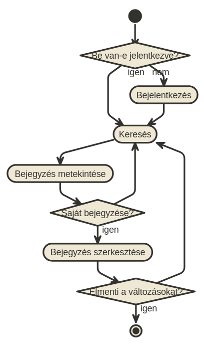

## Tervezés

### Oldalak

#### Fejléc

Minden oldalon található egy fejléc, amin az alkalmazás logóján kívűl a következők vannak:

##### Vendégeknek

- Bejelentkezés gomb
- Regisztráció gomb

##### Felhasználóknak

- Adathalmaz hozzáadása
- Profil gomb, melynek felirata a felhasználónév
- Kijelentkezés gomb

##### Adminisztrátoroknak

Ugyanaz, mint a felhasználóknak, plusz:
- Felhasználók böngészése gomb

#### Oldaltérkép

Az oldaltérkép a fejléc alatti tartalomra vonatkozik.

##### Vendégeknek

- Főoldal: adathalmaz bejegyzések böngészése és keresése
- -> Adathalmaz bejegyzés megtekintése oldal
- Regisztrációs oldal

##### Felhasználóknak

- Főoldal: adathalmaz bejegyzések böngészése és keresése
- -> Adathalmaz bejegyzés megtekintése és értékelése oldal; saját bejegyzés esetén azt törölni is itt lehet
- -> Adathalmaz hozzáadása oldal
- -> Adathalmaz szerkesztése oldal
- Profil megtekintése és szerkesztése oldal

##### Adminisztrátoroknak

- Főoldal: adathalmaz bejegyzések böngészése és keresése
- -> Adathalmaz bejegyzés megtekintése és értékelése oldal; törölni a bejegyzést vagy az egyes értékeléseket is itt lehet
- -> Adathalmaz hozzáadása oldal
- -> Adathalmaz szerkesztése oldal
- Profil megtekintése és szerkesztése oldal
- Felhasználók böngészése és kitiltása oldal

#### Felugró ablakok

Felugró ablakokban lesz:
- a bejelentkezés,
- az értékelés adatainak kitöltése,
- az összes megerősítő kérdés (*Tényleg kitörlöd ezt a bejegyzést?*, stb).

#### Oldalvázlatok

##### Főoldal

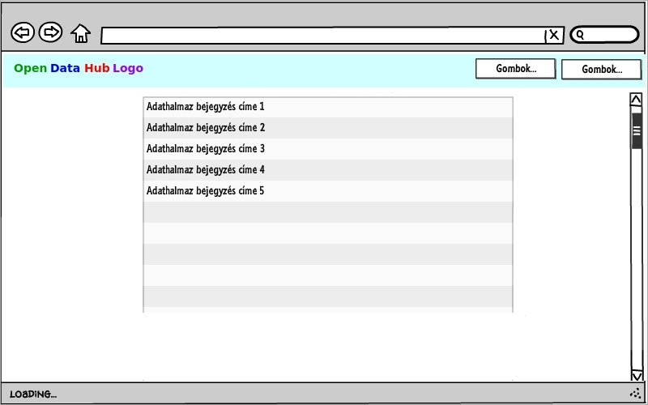

##### Adathalmaz bejegyzés megtekintése és értékelése

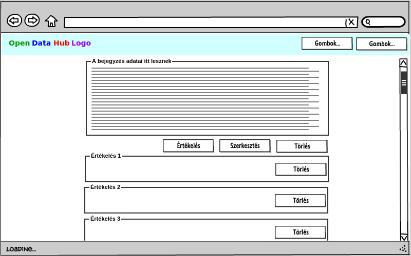

##### Adathalmaz hozzáadása vagy szerkesztése

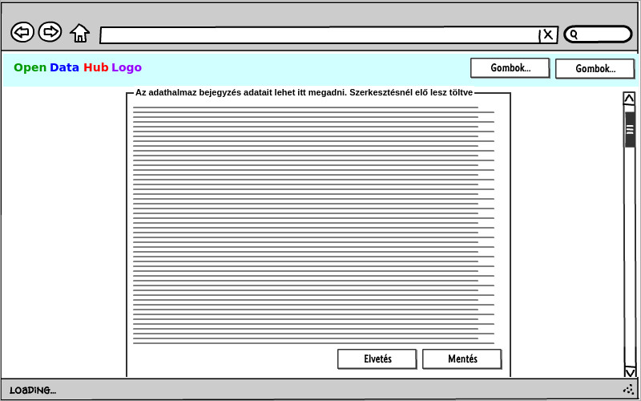

##### Regisztrációs

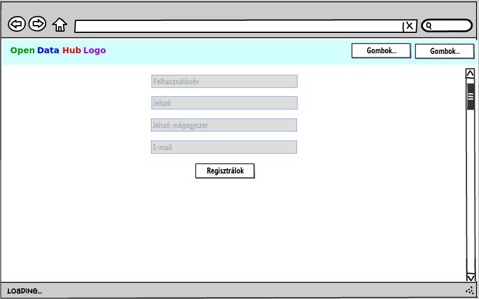

##### Profil megtekintése és szerkesztése

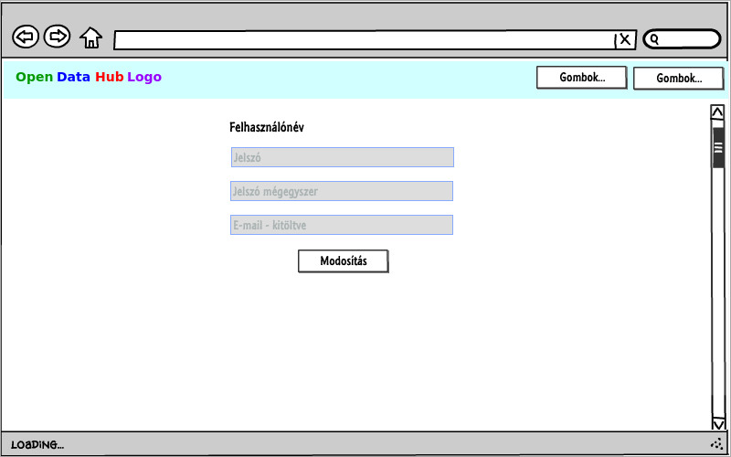

##### Felhasználók böngészése és kitiltása

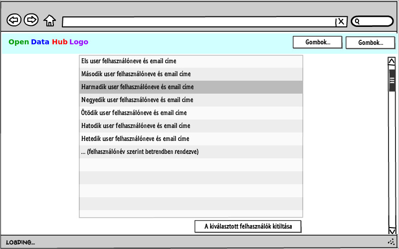

#### Végpontok

- `GET /:query`: főoldal, opcionális keresési paraméterrel
- `POST /login`: bejelentkezési adatok beküldése
- `GET /signup`: regisztrációs oldal
- `POST /signup`: regisztrációs adatok beküldése
- `GET /logout`: kijelentkezési szándék beküldése
- `GET /profile`: profil megtekintése és szerkesztése oldal
- `POST /profile`: szerkesztett profil adatok beküldése
- `GET /user`: felhasználók böngészése és kitiltása oldal
- `POST /user`: felhasználó törlése szándék beküldése
- `GET /:id`: adathalmaz bejegyzés megtekintése oldal
- `GET /:id/delete`: bejegyzés törlése szándék beküldése
- `GET /:id/modify`: bejegyzés szerkesztése oldal
- `POST /:id/modify`: szerkesztett bejegyzési adatok beküldése
- `POST /:id/review/new`: értékelés adatainak beküldése
- `GET /:id/review/:review_id/delete`: értékelés törlése szándék beküldése
- `GET /new`: bejegyzés létrehozása oldal
- `POST /new`: bejegyzés létrehozásához szükséges adatok beküldése

#### Dinamikus működés

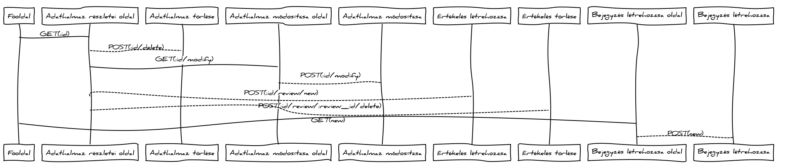

### Entitások

#### Adatmodell

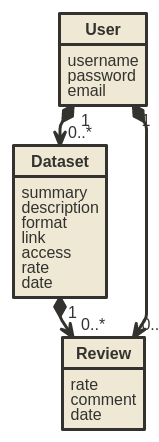

#### Adatbázismodell

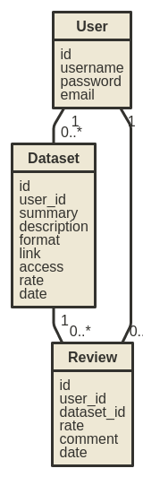

## Implementáció

A szerveroldal Node.js alapon működik és az AdonisJs MVC framework segítségével épül fel.

### Könyvtárstruktúra

Az alkalmazást a repository **webapp** könyvtárában találod meg. A könyvtárstruktúrát az AdonisJs definiálta, amiről [itt](http://www.adonisjs.com/docs/3.1/directory-structure) olvashatsz.

### Fejlesztői környezet

Bármilyen szövegszerkesztő használható a fejlesztéshez. Én [Atom](https://atom.io/)-ot használtam.
