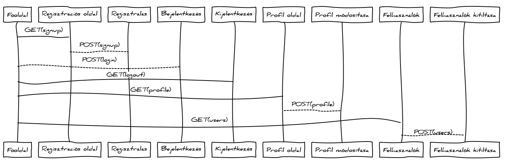

# TODO

- Automatikus futtatókörnyezetet csinálni a tesztekhez
- Megnézni az improvementeket
- Dokumentáció
- Deploy

## Improvements

- A jelszót kétszer bekérni regisztrálásnál és jelszó változtatásnál.
- Profil módosítánál a jelenlegi jelszó bekérése.
- Review előtöltése, ha már van.
- A rate automatikusan frissüljön.
- Ha nem található az adott ID: response.notFound(msg).
- Rendezve küldje le a szerver a listákat.
- A validáció fejlesztése.
- About page.

## Bugs

- A delete dataset funkcióhoz a confirmation nem jelenik meg minden esetben elsőre.

# Elvárások

- Kikapcsolt JavaScript mellett az 1. beadandót kapjuk vissza.
- Dokumentáció:
	- a funkcióban érintett fájlok mind kliens- és szerveroldalon
	- a funkció működésének, folyamatának szöveges leírása (mikor mi történik, milyen eseményekre hogyan reagál, melyik kódrészlet fut le, melyik függvény hívódik meg)
	- valamelyik funkciónál 1 szekvenciadiagram a kiszolgálás folyamatáról
- Tesztek:
	- A tesztesetek felsorolása továbbra is szükséges, ezek mellett automatikus tesztek is szükségesek. Nem kell teljeskörű tesztelés, a hallgató mutassa meg, hogy képes ilyen tesztek írására.
	- Tesztelési környezet bemutatása a dokumentációban (Selenium telepítése, tesztek futtatása)
	- Funkcionális felületi tesztek: legalább 4 folyamat tesztelése Selenium IDE használatával

# Help

- https://github.com/elteKrisztianKereszti/alkfejl_2016_1_7
- https://github.com/horvathgyozo/alkfejl_minta#a-dokument%C3%A1ci%C3%B3-szerkezete
- https://github.com/pessaai/ckd193-beadando

# Technical reference

- http://webprogramozas.inf.elte.hu/alkfejl.php
- http://www.adonisjs.com/docs/3.1
- http://knexjs.org/
- http://chancejs.com/
- http://jquery.com/
- https://bootswatch.com/sandstone/
- http://1000hz.github.io/bootstrap-validator/

# Open Data Hub

Az *Open Data Hub* egy webes alkalmazás, melyen gyűjteni és rendszerezni tudjuk a nyílt adathalmazokat.

##  Követelményanalízis

### Funkcionális követelmények

- Böngészés és keresés az adathalmazok közt.
- Regisztráció felhasználónév, jelszó és email cím megadásával.
- Bejelentkezés felhasználónév és jelszó megadásával.
- Bejelentkezett felhasználóként:
	- saját jelszó és email cím megtekintése és megváltoztatása,
	- bármely adathalmaz értékelése,
	- sajátok hozzáadása, szerkesztése és törlése.
- Adminisztrátorként:
	- felhasználók kitiltása,
	- adathalamazok és értékelések szerkesztése, törlése.

### Nem funkcionális követelmények

- Kinézete modern, az aktuális trendeknek megfelelő.
- Könnyen átlátható és kezelhető felület.
- Gyorsnak ható működés.
- A felhasználók adatainak biztonságos tárolása.
- Könnyű konfigurálhatóság és bővíthetőség.

### Fogalomjegyzék

- **Nyílt adathalmaz**: Olyan adatok összessége, melyek szabadon elérhetőek az interneten.

### Szerepkörök

- **Vendég**: Csak böngészni és keresni tud az adathalmazok közt. Van lehetősége regisztrálni és bejelentkezni.
- **Felhasználó**: Bejelentkezés után a vendég funkcióit továbbra is eléri, ezen felül meg tudja változtatni a saját jelszavát és email címét, tudja bármelyik adathalmazt értékelni és sajátokat hozzáadni, szerkeszteni és törölni.
- **Adminisztrátor**: Bejelentkezés után a vendég és a felhasználó funkcióit is eléri, ezen felül bármely felhasználót ki tud tiltani és bármely adathalmazt és értékelést tud szerkeszteni és törölni.

#### Szerepkörök szerinti használati esetek

##### Példa egy használati eset folyamatára

Felhasználóként egy adathalmaz bejegyzés módosítása:

1. Bejelentkezik, ha ezt még nem tette meg.
2. Megkeresi azt a saját bejegyzését, amit szerkeszteni szeretne.
3. Szerkeszti a bejegyzést.
4. Elmenti vagy elveti a változásokat.

## Tervezés

### Oldalak

#### Fejléc

Minden oldalon található egy fejléc, amin az alkalmazás logóján kívűl a következők vannak:

##### Vendégeknek

- Bejelentkezés gomb
- Regisztráció gomb

##### Felhasználóknak

- Adathalmaz hozzáadása
- Profil gomb, melynek felirata a felhasználónév
- Kijelentkezés gomb

##### Adminisztrátoroknak

Ugyanaz, mint a felhasználóknak, plusz:
- Felhasználók böngészése gomb

#### Oldaltérkép

Az oldaltérkép a fejléc alatti tartalomra vonatkozik.

##### Vendégeknek

- Főoldal: adathalmaz bejegyzések böngészése és keresése
- -> Adathalmaz bejegyzés megtekintése oldal
- Regisztrációs oldal

##### Felhasználóknak

- Főoldal: adathalmaz bejegyzések böngészése
- -> Adathalmaz bejegyzés megtekintése és értékelése oldal; saját bejegyzés esetén azt törölni is itt lehet
- -> Adathalmaz hozzáadása oldal
- -> Adathalmaz szerkesztése oldal
- Profil megtekintése és szerkesztése oldal

##### Adminisztrátoroknak

- Főoldal: adathalmaz bejegyzések böngészése és keresése
- -> Adathalmaz bejegyzés megtekintése és értékelése oldal; törölni a bejegyzést vagy az egyes értékeléseket is itt lehet
- -> Adathalmaz hozzáadása oldal
- -> Adathalmaz szerkesztése oldal
- Profil megtekintése és szerkesztése oldal
- Felhasználók böngészése és kitiltása oldal

#### Felugró ablakok

Felugró ablakokban lesz:
- a bejelentkezés,
- az értékelés adatainak kitöltése,
- az összes megerősítő kérdés (*Tényleg kitörlöd ezt a bejegyzést?*, stb).

#### Oldalvázlatok

##### Főoldal

##### Adathalmaz bejegyzés megtekintése és értékelése

##### Adathalmaz hozzáadása vagy szerkesztése

##### Regisztrációs

##### Profil megtekintése és szerkesztése

##### Felhasználók böngészése és kitiltása

#### Végpontok

- `GET /`: főoldal

##### Felhasználó

- `GET	/signup`: regisztrációs oldal
- `POST	/signup`: regisztrációs adatok beküldése
- `POST	/login`: bejelentkezési adatok beküldése
- `GET	/logout`: kijelentkezési szándék beküldése
- `GET	/profile`: profil megtekintése és szerkesztése oldal
- `POST	/profile`: szerkesztett profil adatok beküldése

##### Admin

- `GET	/manage/users`: felhasználók böngészése és kitiltása oldal
- `POST	/manage/users`: felhasználó törlése szándék beküldése

##### Adathalmaz

- `GET	/dataset/add`: bejegyzés létrehozása oldal
- `POST	/dataset/add`: bejegyzés létrehozásához szükséges adatok beküldése
- `GET	/dataset/:id/show`: adathalmaz bejegyzés megtekintése oldal
- `GET	/dataset/:id/modify`: bejegyzés szerkesztése oldal
- `POST	/dataset/:id/modify`: szerkesztett bejegyzési adatok beküldése
- `GET	/dataset/:id/delete`: bejegyzés törlése szándék beküldése
- `POST	/dataset/:id/review/add`: értékelés adatainak beküldése
- `GET	/dataset/:id/review/:review_id/delete`: értékelés törlése szándék beküldése

#### Dinamikus működés

### Entitások

#### Adatmodell

#### Adatbázismodell

## Implementáció

A szerveroldal Node.js alapon működik és az AdonisJs MVC framework segítségével épül fel.

### Könyvtárstruktúra

Az alkalmazást a repository **webapp** könyvtárában találod meg. A könyvtárstruktúrát az AdonisJs definiálta, amiről [itt](http://www.adonisjs.com/docs/3.1/directory-structure) olvashatsz.

### Fejlesztői környezet

Bármilyen szövegszerkesztő használható a fejlesztéshez. Én [Atom](https://atom.io/)-ot használtam.

### Telepítés (Linux rendszeren)

1. A dependált npm modulok letöltése: `npm install`.
2. A `.env.example` alapján hozz létre egy `.env` fájlt rootban.
3. Az adatbázis létrehozása: `./ace migration:run`.
4. Az adatbázis inicializálása: `./ace db:seed`.
5. Az alkalmazás indítása: `npm start`. Fejlesztéshez ajánlott az `npm run dev`.
